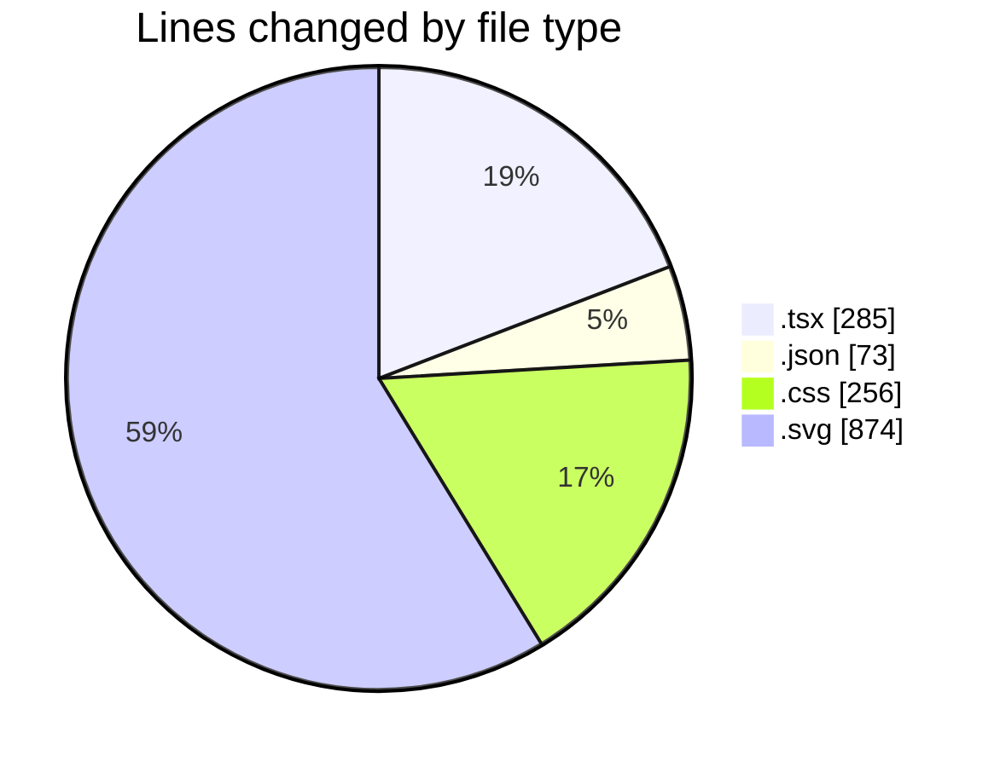
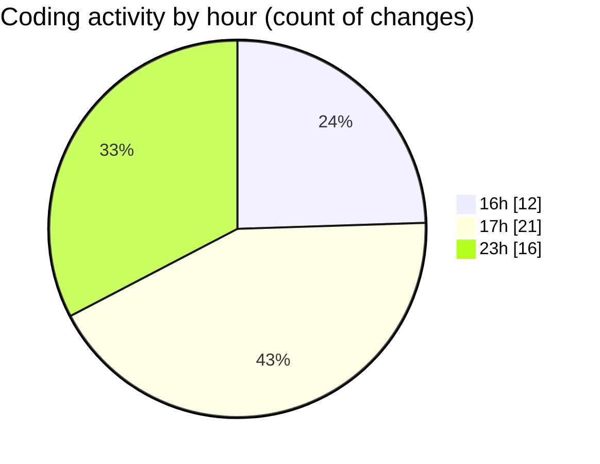

# tw-server - Activity Summary 

## Overall Statistics

| Stat                   | Value                                                             |
| ---------------------- | ----------------------------------------------------------------- |
| **Lines Added** (➕)   | 968                                          |
| **Lines Removed** (➖) | 520                                        |
| **Net Change** (↕)    | 448                |
| **Active Time** (⌚)   | 64 minutes |

## Modified Files
- **App.tsx** (+4, -6)
- **IsometricGrid.tsx** (+55, -0)
- **package.json** (+40, -1)
- **main.tsx** (+78, -55)
- **grid.tsx** (+33, -0)
- **settings.json** (+1, -0)
- **__root.tsx** (+53, -1)
- **tailwind.css** (+164, -92)
- **keybindings.json** (+18, -13)
- **template-oss.svg** (+367, -258)
- **template-horizon.svg** (+155, -94)

## Visualizations

### By File Type (Lines Changed)

### By Hour (Estimated Activity Count)

> **Last Updated:** 05/08/2025, 23:19:26