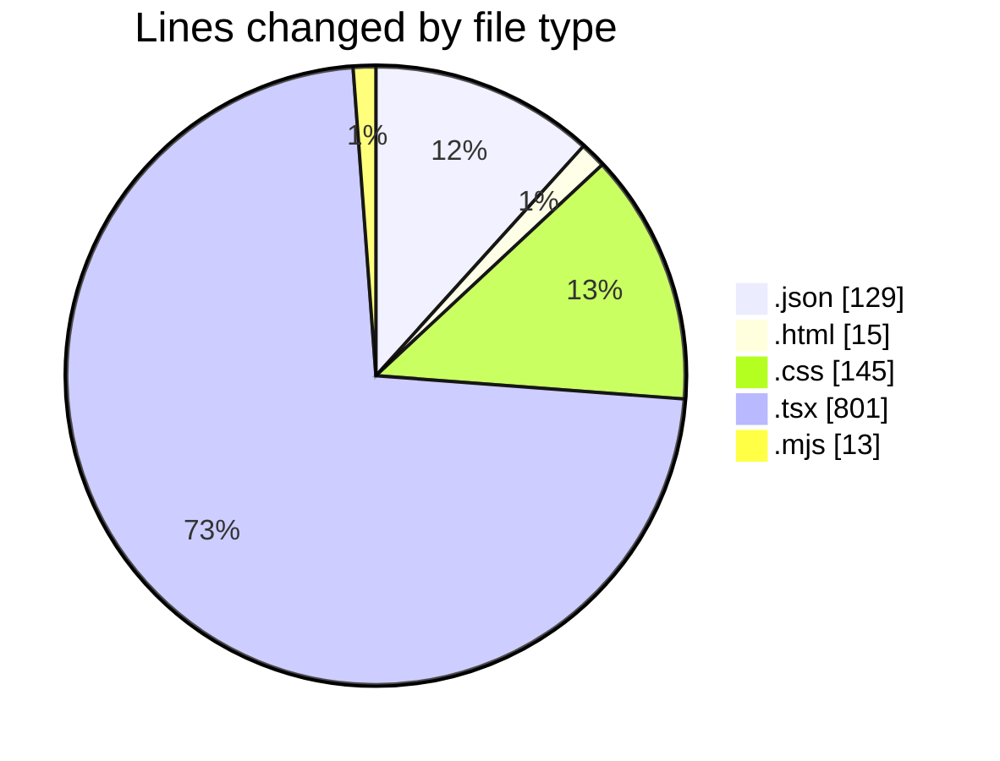
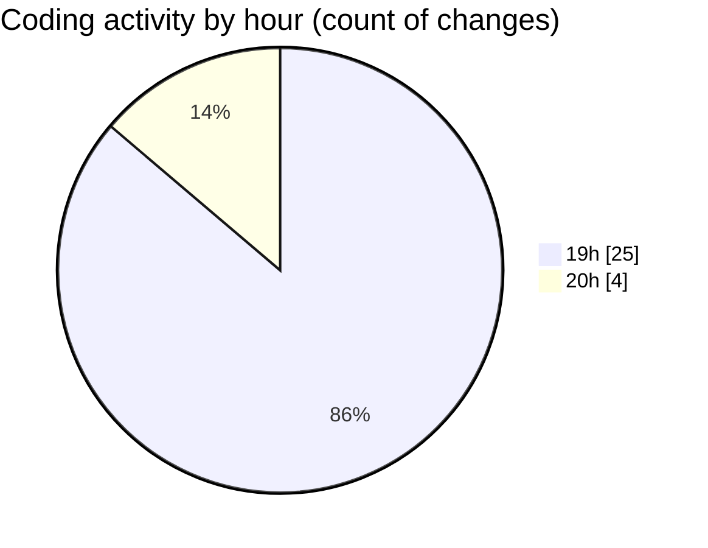

# remakes - Activity Summary 

## Overall Statistics

| Stat                   | Value                                                             |
| ---------------------- | ----------------------------------------------------------------- |
| **Lines Added** (➕)   | 1017                                          |
| **Lines Removed** (➖) | 86                                        |
| **Net Change** (↕)    | 931                |
| **Active Time** (⌚)   | 33 minutes |

## Modified Files
- **package.json** (+43, -0)
- **index.html** (+14, -1)
- **index.css** (+69, -68)
- **App.tsx** (+36, -13)
- **main.tsx** (+11, -1)
- **tsconfig.json** (+16, -0)
- **tsconfig.node.json** (+34, -2)
- **tsconfig.app.json** (+34, -0)
- **tailwind.css** (+7, -1)
- **alert.tsx** (+96, -0)
- **avatar.tsx** (+85, -0)
- **badge.tsx** (+83, -0)
- **prettier.config.mjs** (+13, -0)
- **button.tsx** (+205, -0)
- **dialog.tsx** (+87, -0)
- **dropdown.tsx** (+184, -0)

## Visualizations

### By File Type (Lines Changed)

### By Hour (Estimated Activity Count)

> **Last Updated:** 06/08/2025, 20:01:35