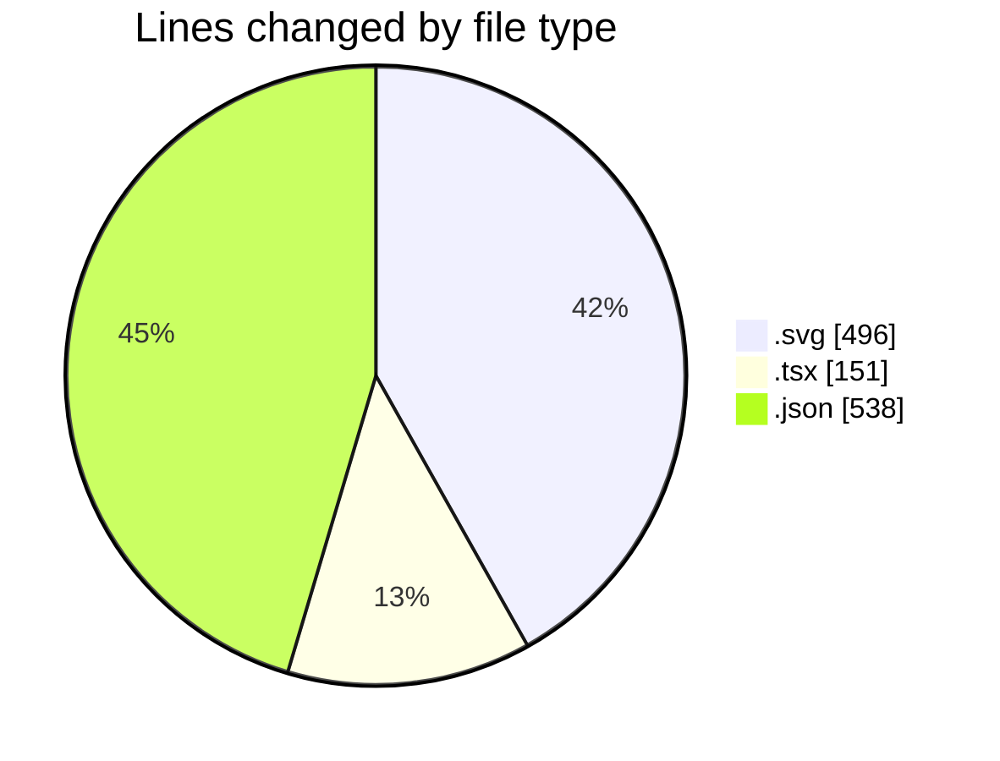
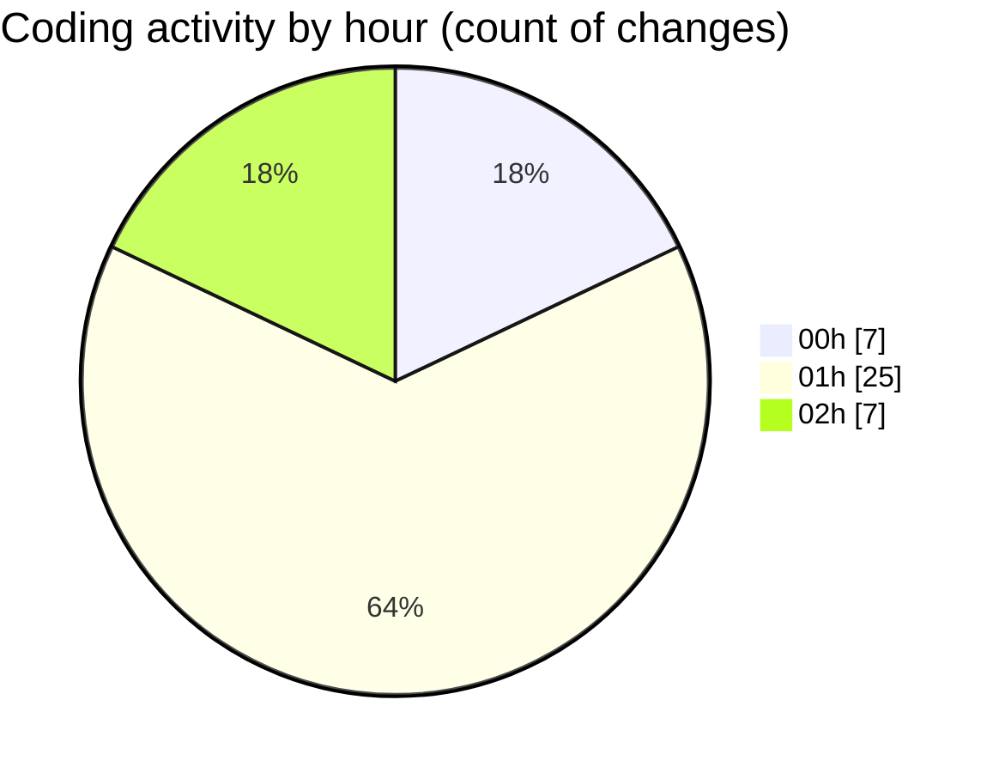

# tw-server - Activity Summary 

## Overall Statistics

| Stat                   | Value                                                             |
| ---------------------- | ----------------------------------------------------------------- |
| **Lines Added** (➕)   | 1139                                          |
| **Lines Removed** (➖) | 46                                        |
| **Net Change** (↕)    | 1093                |
| **Active Time** (⌚)   | 60 minutes |

## Modified Files
- **template-horizon.svg** (+70, -2)
- **App.tsx** (+151, -0)
- **template-horizon-2.svg** (+77, -34)
- **settings.json** (+538, -0)
- **featured-image.svg** (+47, -5)
- **featured-superwhisper.svg** (+42, -0)
- **featured.svg** (+46, -4)
- **featured-autorama.svg** (+42, -0)
- **featured-jdsports.svg** (+42, -1)
- **featured-dominos.svg** (+42, -0)
- **featured-vmo2.svg** (+42, -0)

## Visualizations

### By File Type (Lines Changed)

### By Hour (Estimated Activity Count)

> **Last Updated:** 06/08/2025, 02:15:15