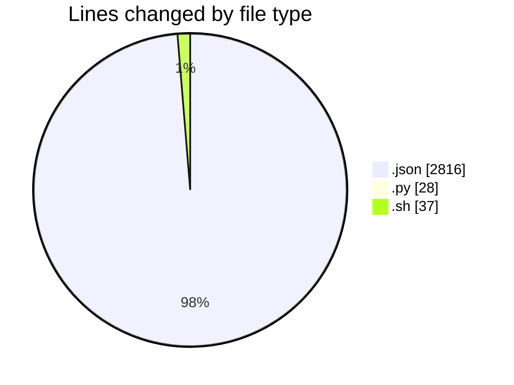
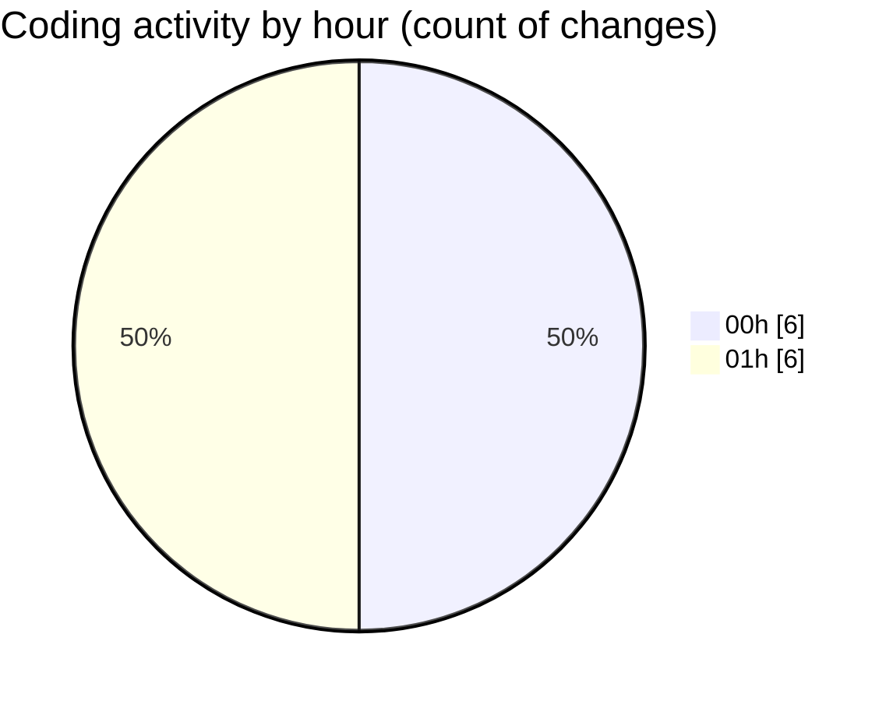

# .claude - Activity Summary 

## Overall Statistics

| Stat                   | Value                                                             |
| ---------------------- | ----------------------------------------------------------------- |
| **Lines Added** (➕)   | 2871                                          |
| **Lines Removed** (➖) | 10                                        |
| **Net Change** (↕)    | 2861                |
| **Active Time** (⌚)   | 15 minutes |

## Modified Files
- **.claude.json** (+2804, -0)
- **settings.json** (+12, -0)
- **UserPromptSubmit.py** (+24, -4)
- **UserPromptSubmit.sh** (+31, -6)

## Visualizations

### By File Type (Lines Changed)

### By Hour (Estimated Activity Count)

> **Last Updated:** 07/08/2025, 01:09:14