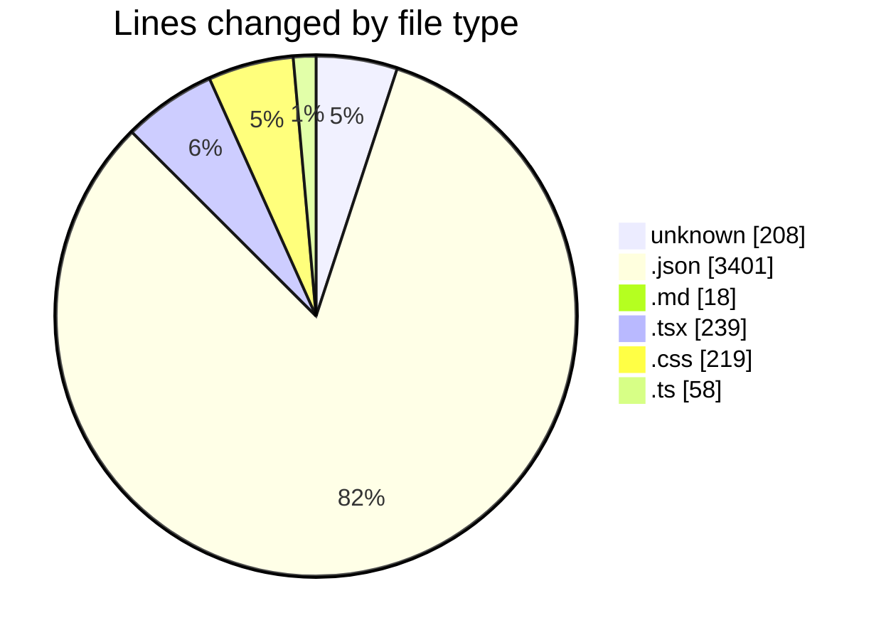
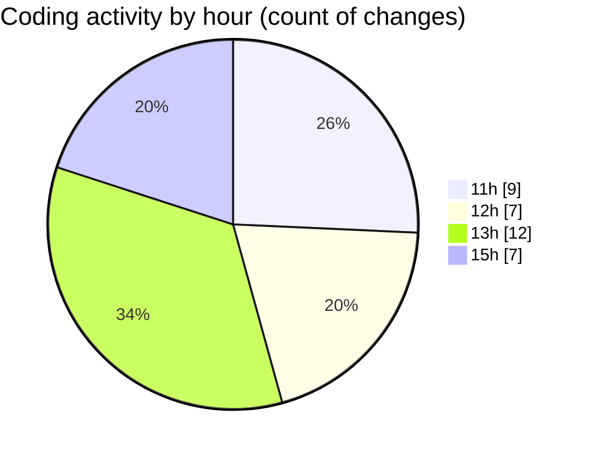

# ribbon - Activity Summary 

## Overall Statistics

| Stat                   | Value                                                             |
| ---------------------- | ----------------------------------------------------------------- |
| **Lines Added** (➕)   | 4058                                          |
| **Lines Removed** (➖) | 85                                        |
| **Net Change** (↕)    | 3973                |
| **Active Time** (⌚)   | 40 minutes |

## Modified Files
- **.cursorrules** (+35, -11)
- **package.json** (+275, -3)
- **.gitignore_global** (+128, -0)
- **$FEATURE.md** (+18, -0)
- **MaterialsFinder.tsx** (+177, -0)
- **DropArea.tsx** (+62, -0)
- **globals.css** (+219, -0)
- **settings.json** (+128, -41)
- **.editorconfig** (+34, -0)
- **repairTextBlocks.ts** (+58, -0)
- **.claude.json** (+2924, -30)

## Visualizations

### By File Type (Lines Changed)

### By Hour (Estimated Activity Count)

> **Last Updated:** 07/08/2025, 15:46:24