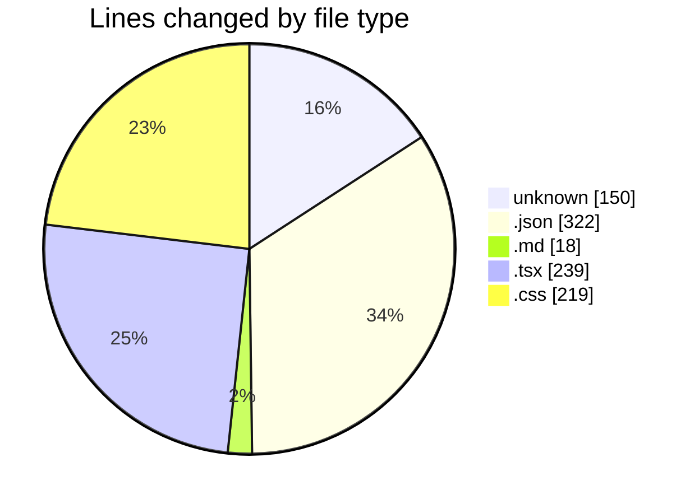
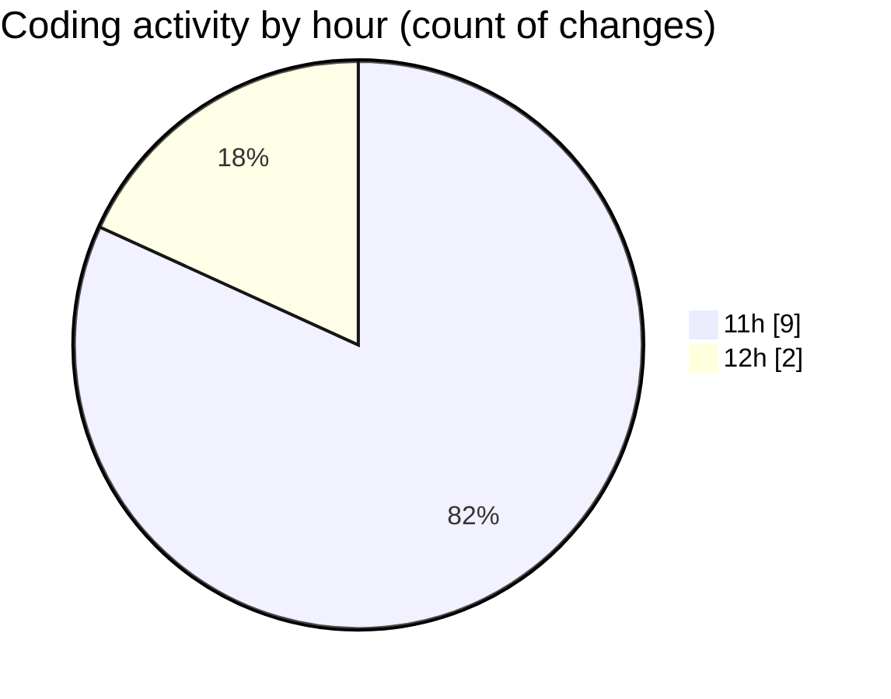

# ribbon - Activity Summary 

## Overall Statistics

| Stat                   | Value                                                             |
| ---------------------- | ----------------------------------------------------------------- |
| **Lines Added** (➕)   | 948                                          |
| **Lines Removed** (➖) | 0                                        |
| **Net Change** (↕)    | 948                |
| **Active Time** (⌚)   | 11 minutes |

## Modified Files
- **.cursorrules** (+24, -0)
- **package.json** (+275, -0)
- **.gitignore_global** (+126, -0)
- **$FEATURE.md** (+18, -0)
- **MaterialsFinder.tsx** (+177, -0)
- **DropArea.tsx** (+62, -0)
- **globals.css** (+219, -0)
- **settings.json** (+47, -0)

## Visualizations

### By File Type (Lines Changed)

### By Hour (Estimated Activity Count)

> **Last Updated:** 07/08/2025, 12:04:07