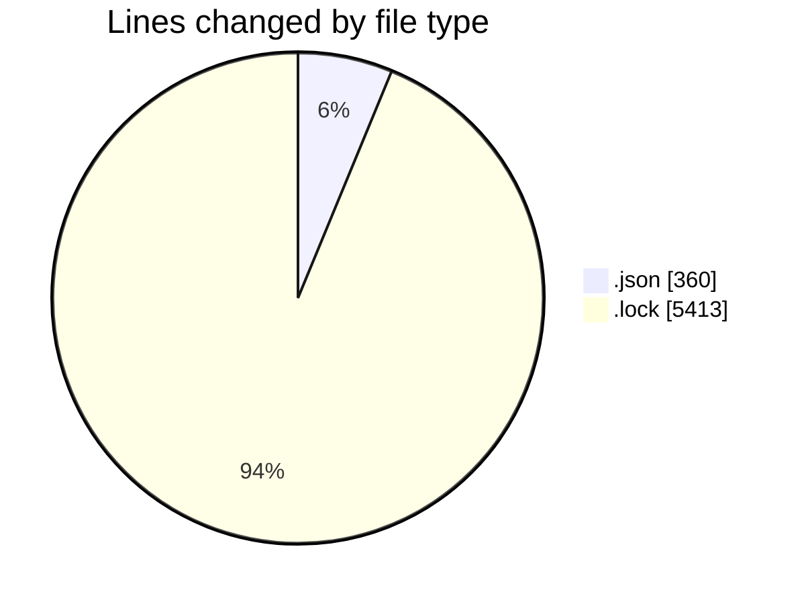
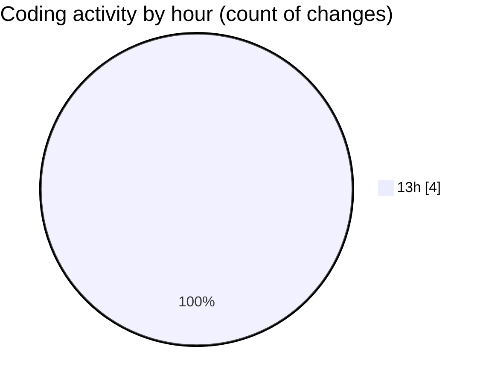

# ribbon - Activity Summary 

## Overall Statistics

| Stat                   | Value                                                             |
| ---------------------- | ----------------------------------------------------------------- |
| **Lines Added** (➕)   | 5673                                          |
| **Lines Removed** (➖) | 100                                        |
| **Net Change** (↕)    | 5573                |
| **Active Time** (⌚)   | 4 minutes |

## Modified Files
- **package.json** (+318, -42)
- **bun.lock** (+5355, -58)

## Visualizations

### By File Type (Lines Changed)

### By Hour (Estimated Activity Count)

> **Last Updated:** 11/08/2025, 13:38:37