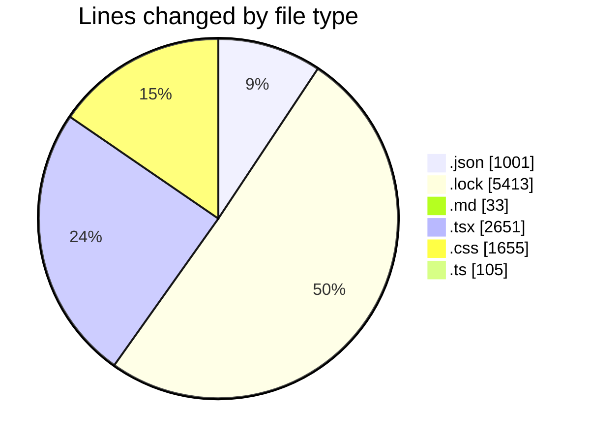
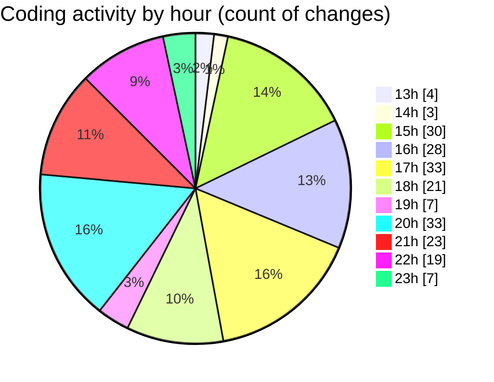

# ribbon - Activity Summary 

## Overall Statistics

| Stat                   | Value                                                             |
| ---------------------- | ----------------------------------------------------------------- |
| **Lines Added** (➕)   | 9580                                          |
| **Lines Removed** (➖) | 1278                                        |
| **Net Change** (↕)    | 8302                |
| **Active Time** (⌚)   | 306 minutes |

## Modified Files
- **package.json** (+372, -42)
- **bun.lock** (+5355, -58)
- **settings.json** (+539, -1)
- **DropArea-actual-flow-gemini.md** (+33, -0)
- **page.tsx** (+20, -5)
- **DropArea.tsx** (+586, -377)
- **DropAreaController.tsx** (+71, -0)
- **page.tsx** (+19, -3)
- **page.tsx** (+16, -0)
- **DropArea.tsx** (+252, -101)
- **DnDStateControllerDemo.tsx** (+104, -3)
- **page.tsx** (+16, -3)
- **layout.tsx** (+18, -4)
- **DropArea.tsx** (+140, -3)
- **DropAreaController.tsx** (+71, -0)
- **CursorGlowButton.tsx** (+40, -2)
- **page.tsx** (+23, -3)
- **globals.css** (+1059, -596)
- **tsconfig.json** (+47, -0)
- **DnDStateControllerDemo.tsx** (+210, -76)
- **SimpleCard.tsx** (+27, -0)
- **Finder.tsx** (+191, -0)
- **react-dropzone.d.ts** (+104, -1)
- **MaterialsFinder.tsx** (+179, -0)
- **MaterialSelector.tsx** (+88, -0)

## Visualizations

### By File Type (Lines Changed)

### By Hour (Estimated Activity Count)

> **Last Updated:** 11/08/2025, 23:14:18