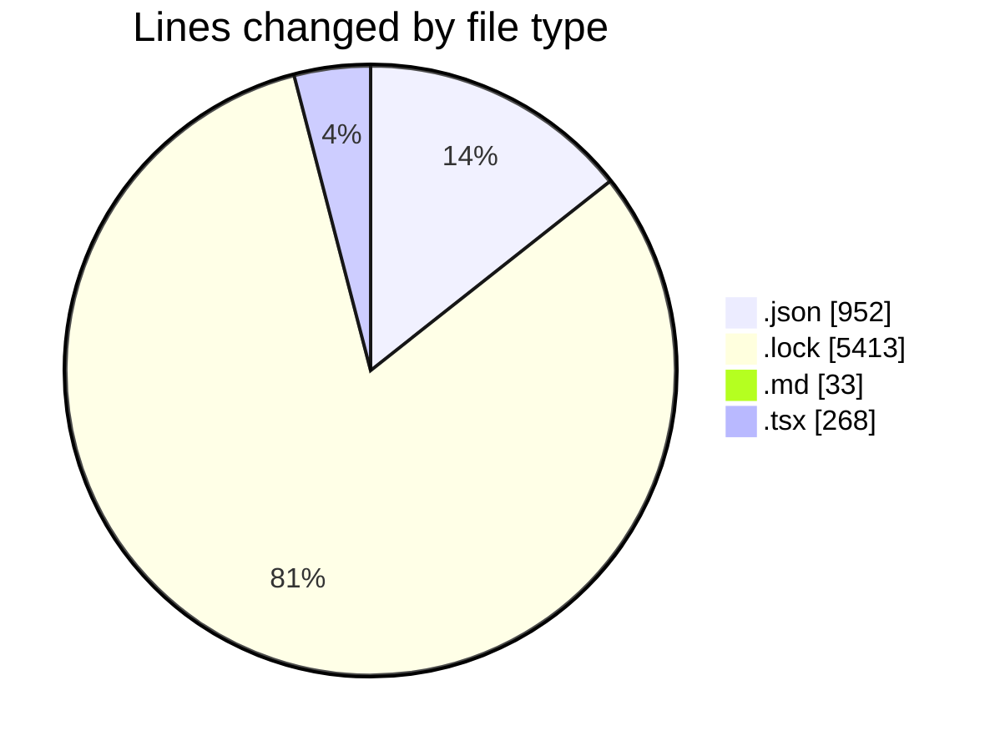
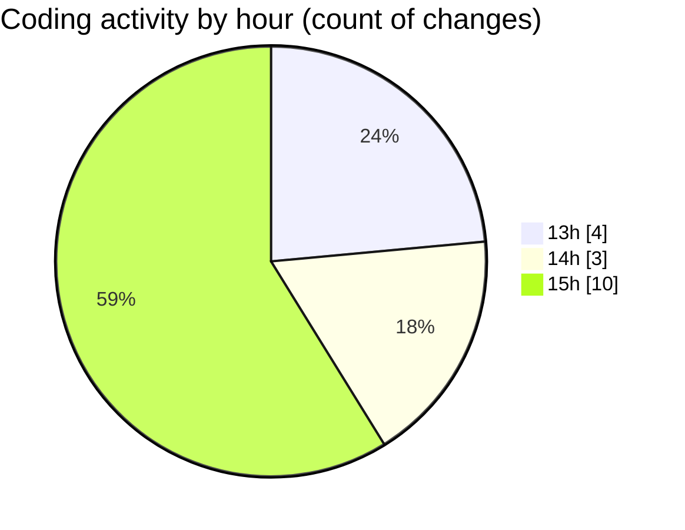

# ribbon - Activity Summary 

## Overall Statistics

| Stat                   | Value                                                             |
| ---------------------- | ----------------------------------------------------------------- |
| **Lines Added** (➕)   | 6563                                          |
| **Lines Removed** (➖) | 103                                        |
| **Net Change** (↕)    | 6460                |
| **Active Time** (⌚)   | 16 minutes |

## Modified Files
- **package.json** (+372, -42)
- **bun.lock** (+5355, -58)
- **settings.json** (+538, -0)
- **DropArea-actual-flow-gemini.md** (+33, -0)
- **page.tsx** (+19, -0)
- **DropArea.tsx** (+140, -0)
- **DropAreaController.tsx** (+71, -0)
- **page.tsx** (+19, -3)
- **page.tsx** (+16, -0)

## Visualizations

### By File Type (Lines Changed)

### By Hour (Estimated Activity Count)

> **Last Updated:** 11/08/2025, 15:29:17