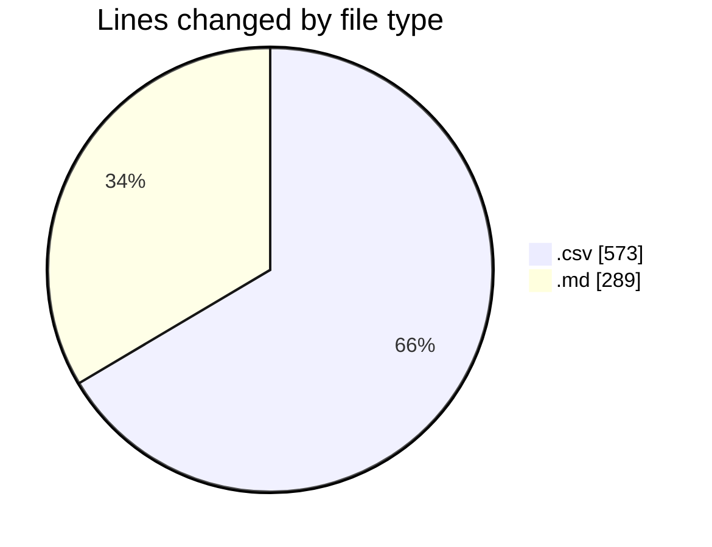
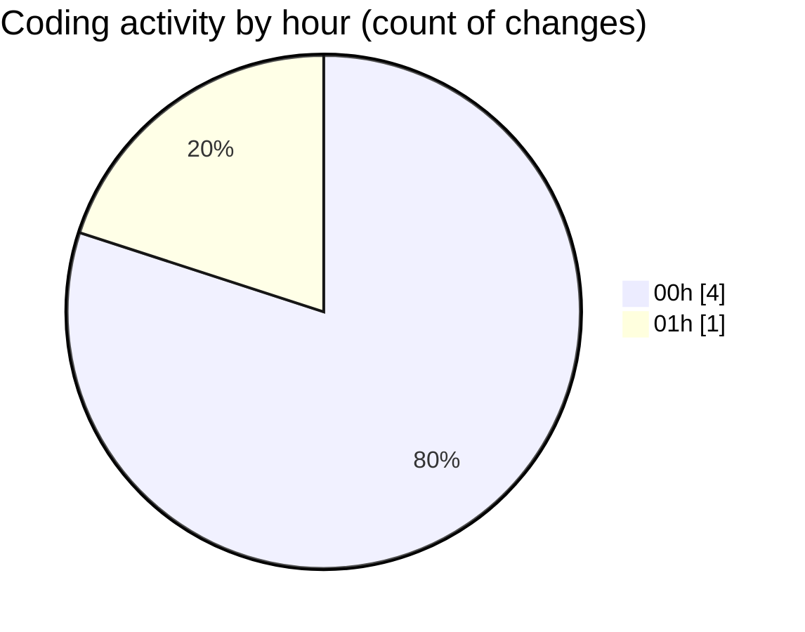

# transactions-new - Activity Summary 

## Overall Statistics

| Stat                   | Value                                                             |
| ---------------------- | ----------------------------------------------------------------- |
| **Lines Added** (➕)   | 862                                          |
| **Lines Removed** (➖) | 0                                        |
| **Net Change** (↕)    | 862                |
| **Active Time** (⌚)   | 1 minute |

## Modified Files
- **Expenses.csv** (+144, -0)
- **Expenses2.csv** (+144, -0)
- **Expenses2_terse.csv** (+141, -0)
- **Expenses.csv** (+144, -0)
- **schema.md** (+289, -0)

## Visualizations

### By File Type (Lines Changed)

### By Hour (Estimated Activity Count)

> **Last Updated:** 11/08/2025, 01:24:27