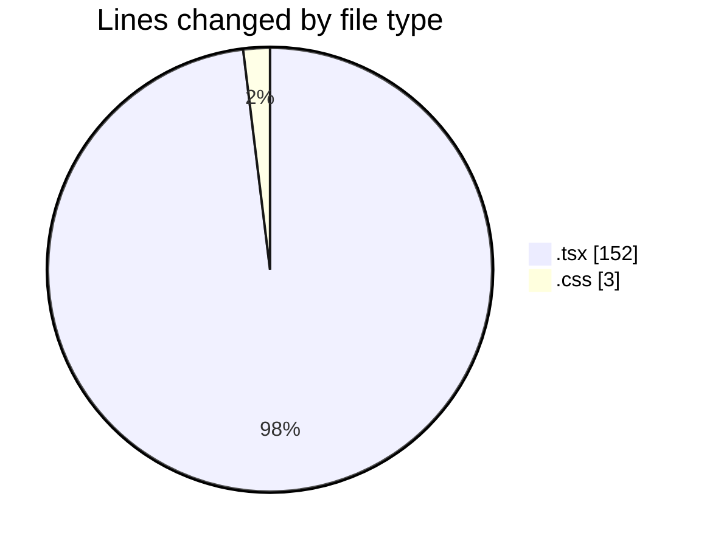

# ribbon - Activity Summary 

## Overall Statistics

| Stat                   | Value                                                             |
| ---------------------- | ----------------------------------------------------------------- |
| **Lines Added** (➕)   | 152                                          |
| **Lines Removed** (➖) | 3                                        |
| **Net Change** (↕)    | 149                |
| **Active Time** (⌚)   | 5 minutes |

## Modified Files
- **DnDStateControllerDemo.tsx** (+134, -0)
- **useDropAreaState.tsx** (+18, -0)
- **globals.css** (+0, -3)

## Visualizations

### By File Type (Lines Changed)

### By Hour (Estimated Activity Count)

> **Last Updated:** 12/08/2025, 00:14:18