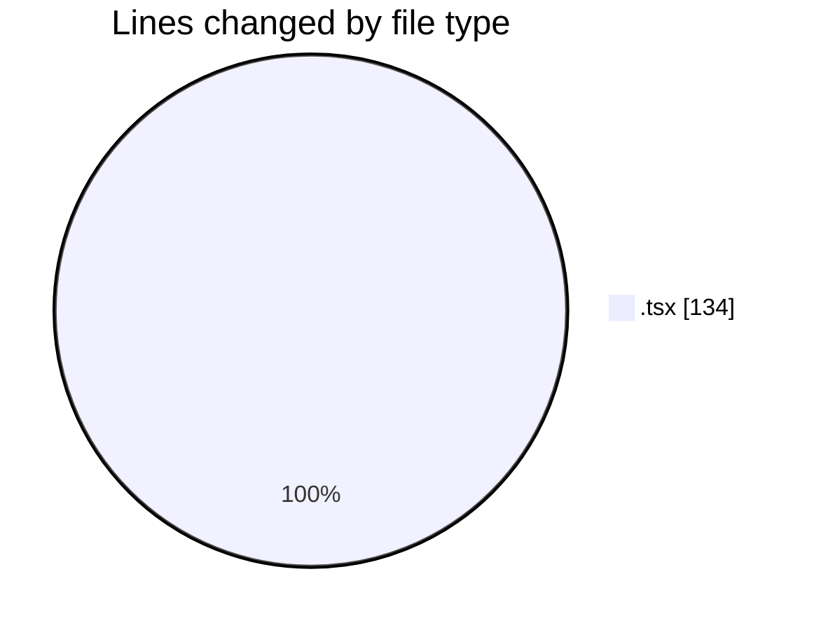
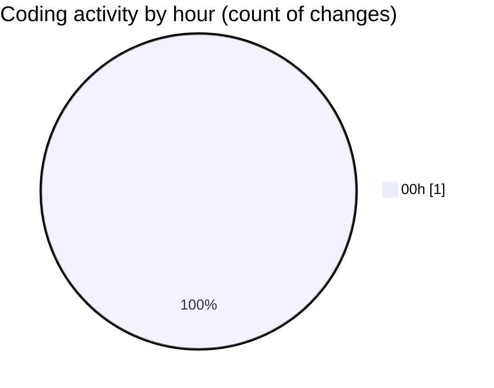

# ribbon - Activity Summary 

## Overall Statistics

| Stat                   | Value                                                             |
| ---------------------- | ----------------------------------------------------------------- |
| **Lines Added** (➕)   | 134                                          |
| **Lines Removed** (➖) | 0                                        |
| **Net Change** (↕)    | 134                |
| **Active Time** (⌚)   | 0 minute |

## Modified Files
- **DnDStateControllerDemo.tsx** (+134, -0)

## Visualizations

### By File Type (Lines Changed)

### By Hour (Estimated Activity Count)

> **Last Updated:** 12/08/2025, 00:09:18