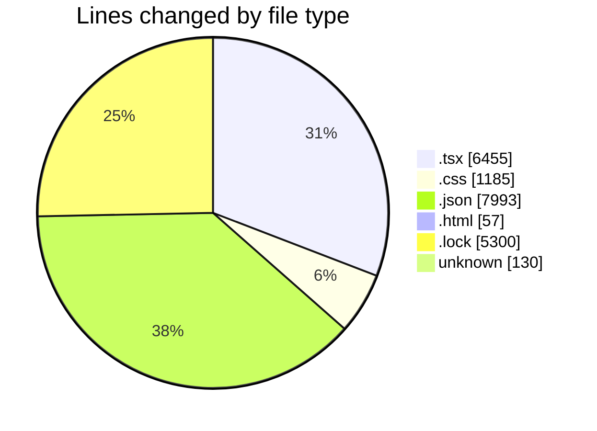
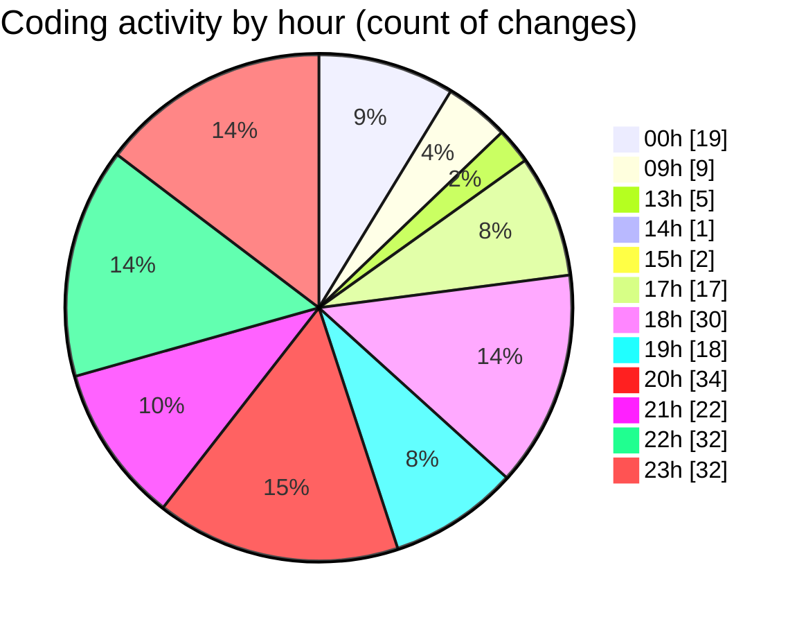

# ribbon - Activity Summary 

## Overall Statistics

| Stat                   | Value                                                             |
| ---------------------- | ----------------------------------------------------------------- |
| **Lines Added** (➕)   | 19042                                          |
| **Lines Removed** (➖) | 2078                                        |
| **Net Change** (↕)    | 16964                |
| **Active Time** (⌚)   | 292 minutes |

## Modified Files
- **DnDStateControllerDemo.tsx** (+268, -6)
- **useDropAreaState.tsx** (+614, -451)
- **globals.css** (+903, -282)
- **MaterialSelector.tsx** (+101, -21)
- **MaterialsFinder.tsx** (+561, -216)
- **Finder.tsx** (+381, -37)
- **DropArea.tsx** (+623, -238)
- **LoadingFinder.tsx** (+94, -0)
- **settings.json** (+1076, -1)
- **separator.tsx** (+35, -0)
- **preview-head.html** (+57, -0)
- **bun.lock** (+5298, -2)
- **.claude.json** (+6898, -0)
- **.mcp.json** (+18, -0)
- **.gitignore_global** (+130, -0)
- **page.tsx** (+671, -602)
- **page.tsx** (+14, -2)
- **AuroraMeshInset.tsx** (+183, -0)
- **SiriAurora.tsx** (+153, -0)
- **DnDStateControllerDemo.tsx** (+134, -6)
- **Aurora.tsx** (+40, -2)
- **page.tsx** (+27, -21)
- **DropArea.tsx** (+173, -0)
- **Controller.tsx** (+26, -0)
- **MorphingGradient.tsx** (+109, -2)
- **page.tsx** (+199, -169)
- **$DnDStateControllerDemo.tsx** (+128, -0)
- **$DnDStateControllerDemo.tsx** (+128, -20)

## Visualizations

### By File Type (Lines Changed)

### By Hour (Estimated Activity Count)

> **Last Updated:** 12/08/2025, 23:47:57