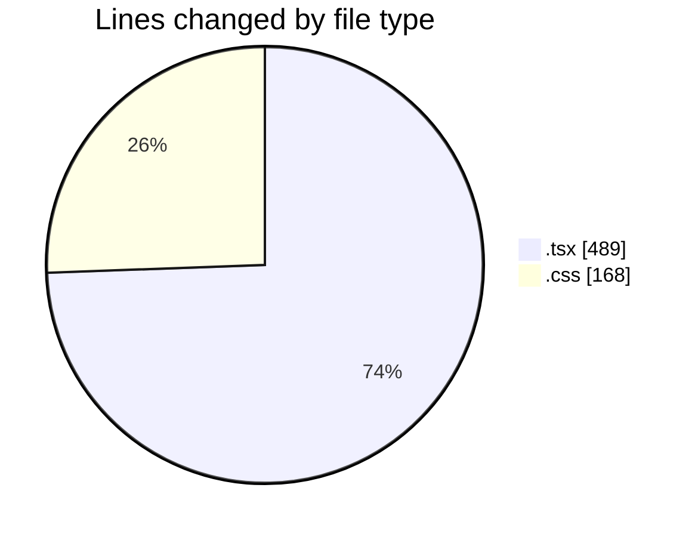
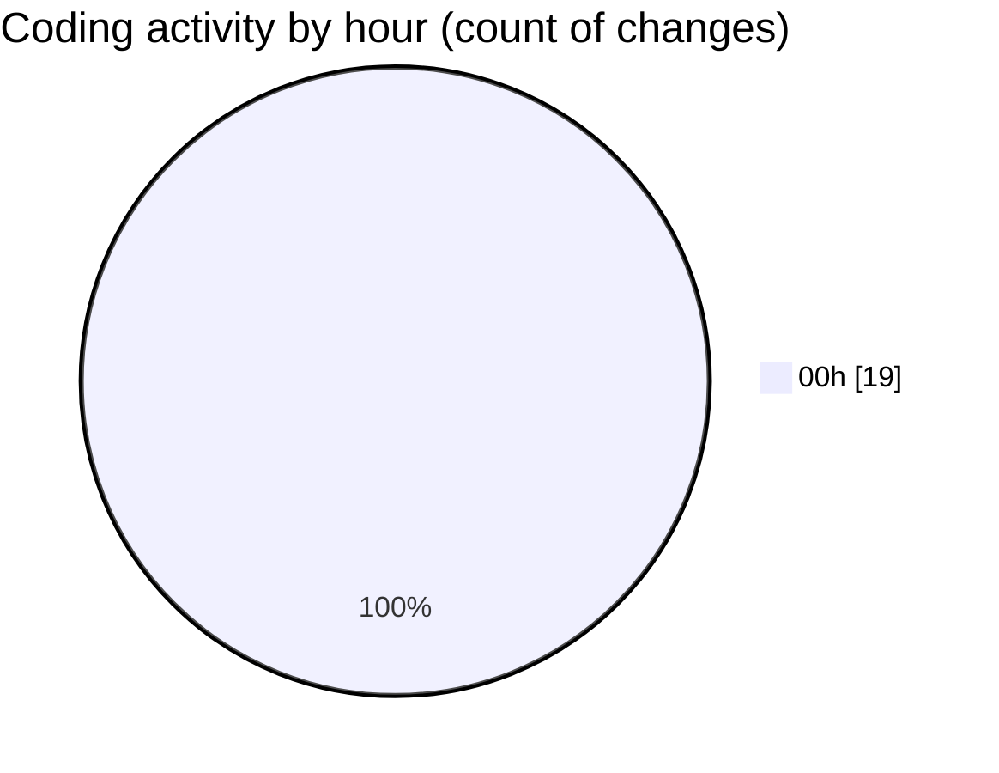

# ribbon - Activity Summary 

## Overall Statistics

| Stat                   | Value                                                             |
| ---------------------- | ----------------------------------------------------------------- |
| **Lines Added** (➕)   | 564                                          |
| **Lines Removed** (➖) | 93                                        |
| **Net Change** (↕)    | 471                |
| **Active Time** (⌚)   | 28 minutes |

## Modified Files
- **DnDStateControllerDemo.tsx** (+134, -0)
- **useDropAreaState.tsx** (+19, -2)
- **globals.css** (+89, -79)
- **MaterialSelector.tsx** (+4, -0)
- **MaterialsFinder.tsx** (+6, -6)
- **Finder.tsx** (+5, -5)
- **DropArea.tsx** (+260, -1)
- **LoadingFinder.tsx** (+47, -0)

## Visualizations

### By File Type (Lines Changed)

### By Hour (Estimated Activity Count)

> **Last Updated:** 12/08/2025, 00:34:18