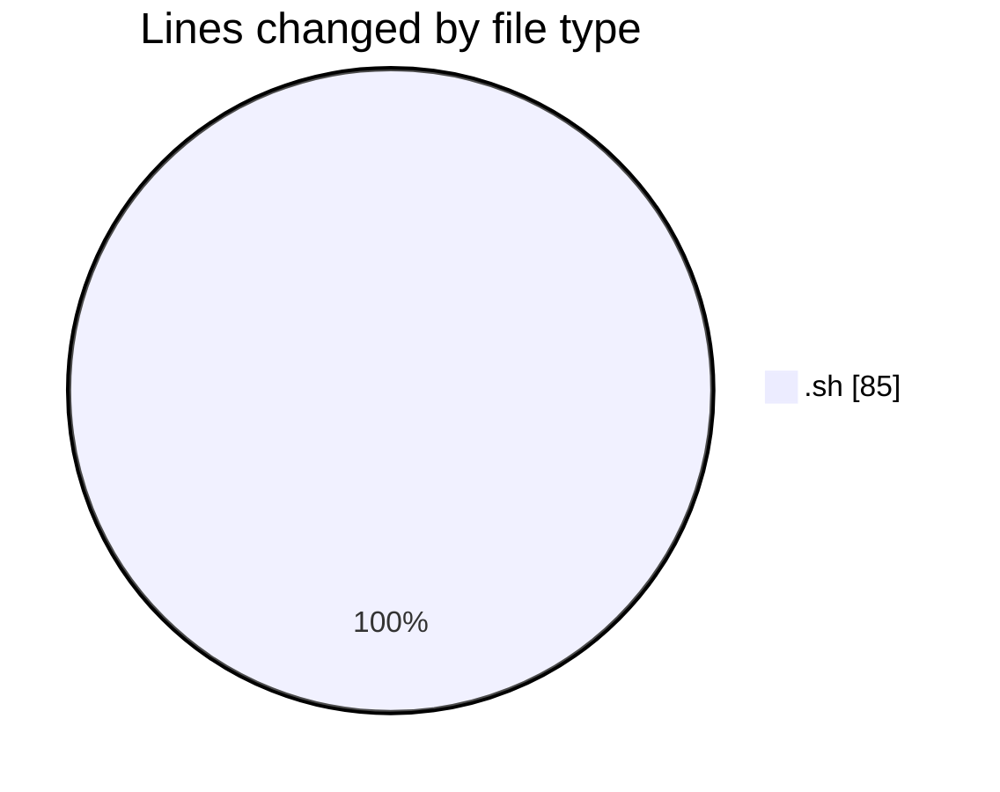
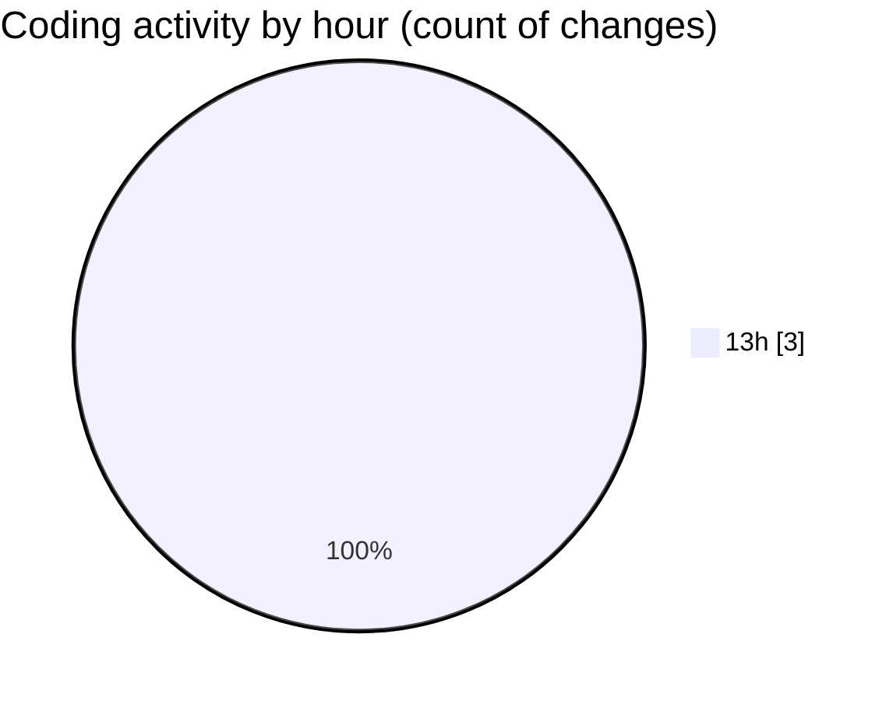

# .raycast - Activity Summary 

## Overall Statistics

| Stat                   | Value                                                             |
| ---------------------- | ----------------------------------------------------------------- |
| **Lines Added** (➕)   | 85                                          |
| **Lines Removed** (➖) | 0                                        |
| **Net Change** (↕)    | 85                |
| **Active Time** (⌚)   | 1 minute |

## Modified Files
- **ipad.sh** (+1, -0)
- **ipad-mirroring-connect.sh** (+42, -0)
- **ipad-mirroring.sh** (+42, -0)

## Visualizations

### By File Type (Lines Changed)

### By Hour (Estimated Activity Count)

> **Last Updated:** 13/08/2025, 13:45:54