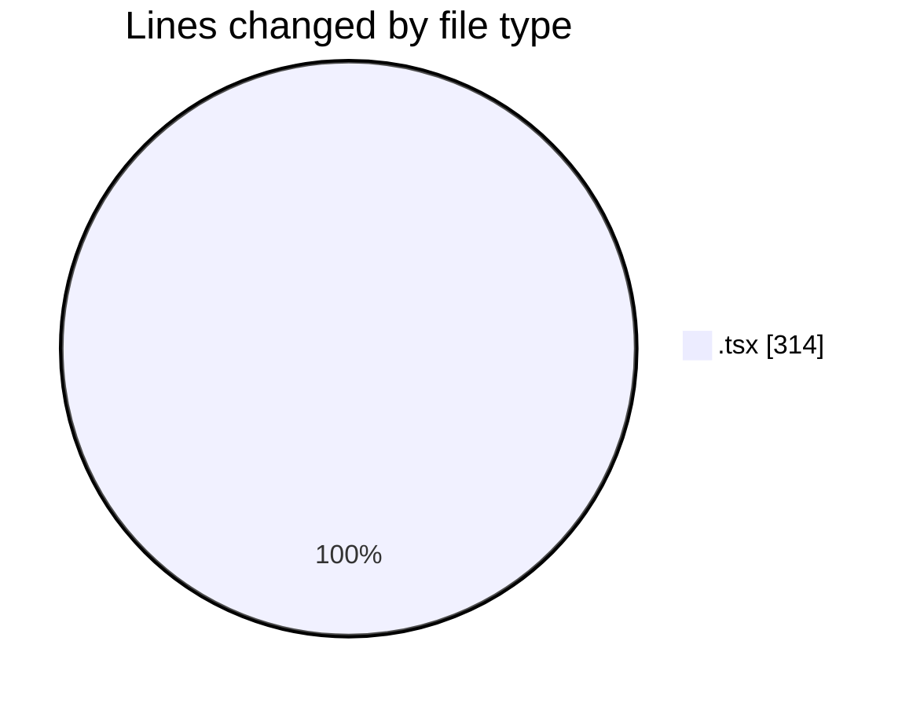
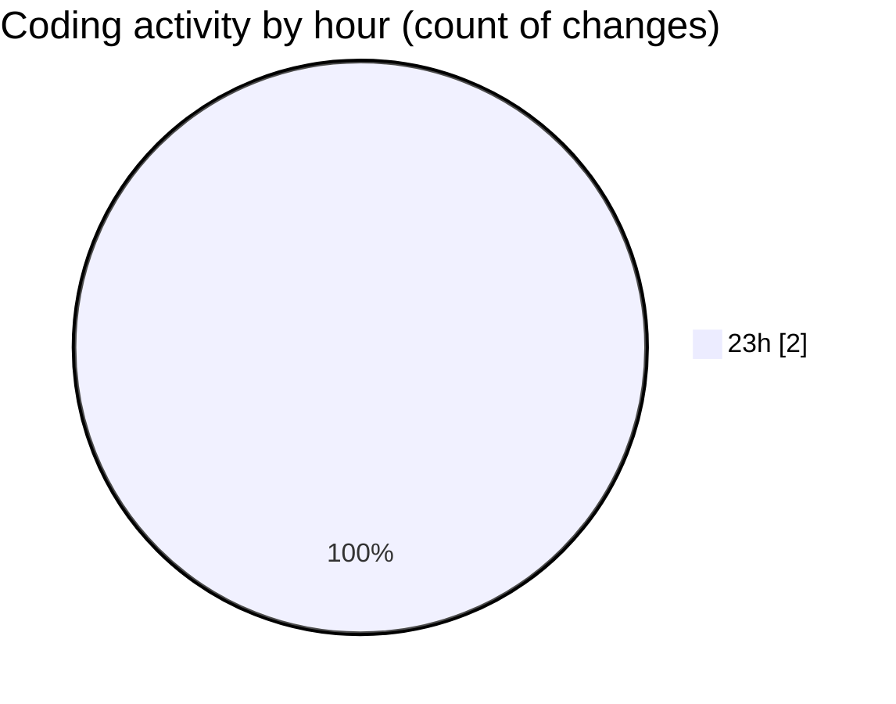

# ribbon - Activity Summary 

## Overall Statistics

| Stat                   | Value                                                             |
| ---------------------- | ----------------------------------------------------------------- |
| **Lines Added** (➕)   | 157                                          |
| **Lines Removed** (➖) | 157                                        |
| **Net Change** (↕)    | 0                |
| **Active Time** (⌚)   | 1 minute |

## Modified Files
- **useDropAreaState.tsx** (+157, -157)

## Visualizations

### By File Type (Lines Changed)

### By Hour (Estimated Activity Count)

> **Last Updated:** 13/08/2025, 00:02:57