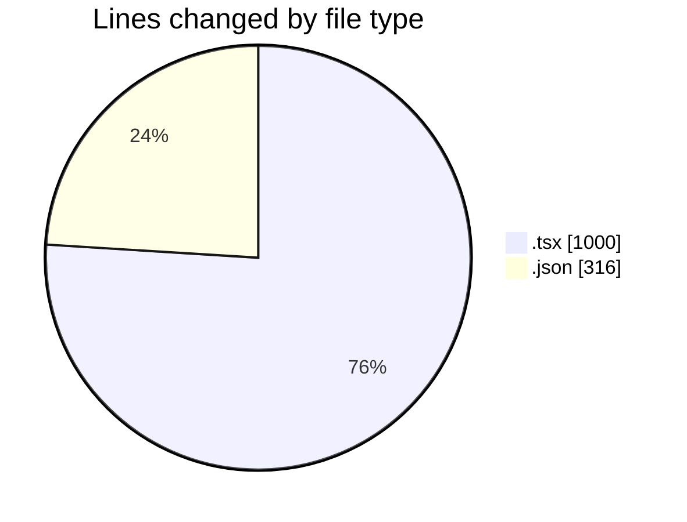
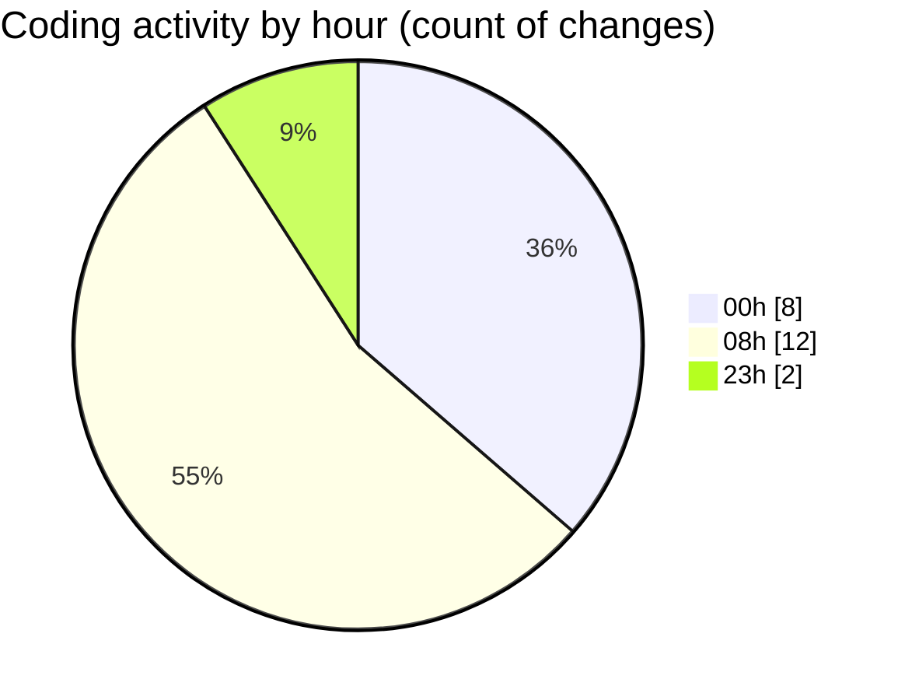

# ribbon - Activity Summary 

## Overall Statistics

| Stat                   | Value                                                             |
| ---------------------- | ----------------------------------------------------------------- |
| **Lines Added** (➕)   | 887                                          |
| **Lines Removed** (➖) | 429                                        |
| **Net Change** (↕)    | 458                |
| **Active Time** (⌚)   | 33 minutes |

## Modified Files
- **useDropAreaState.tsx** (+324, -290)
- **package.json** (+272, -0)
- **_Lamp.tsx** (+105, -0)
- **page.tsx** (+0, -34)
- **tsconfig.json** (+44, -0)
- **$DropArea.tsx** (+135, -10)
- **DropArea.tsx** (+7, -95)

## Visualizations

### By File Type (Lines Changed)

### By Hour (Estimated Activity Count)

> **Last Updated:** 13/08/2025, 08:47:58