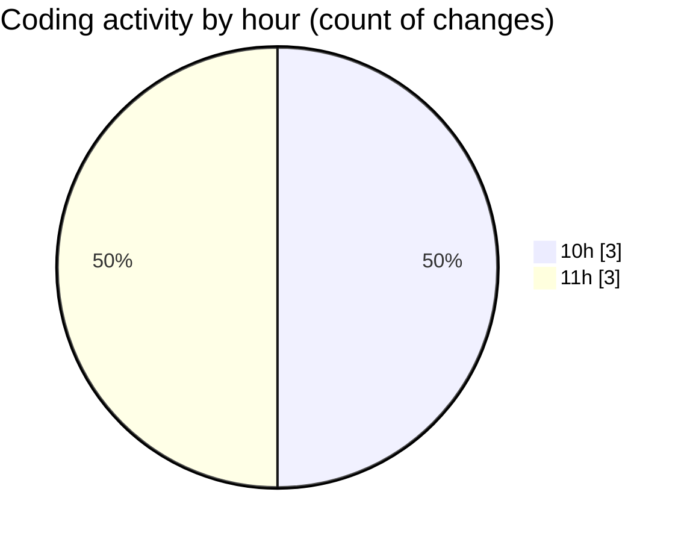

# ribbon - Activity Summary 

## Overall Statistics

| Stat                   | Value                                                             |
| ---------------------- | ----------------------------------------------------------------- |
| **Lines Added** (➕)   | 1879                                          |
| **Lines Removed** (➖) | 0                                        |
| **Net Change** (↕)    | 1879                |
| **Active Time** (⌚)   | 5 minutes |

## Modified Files
- **settings.json** (+1776, -0)
- **DropArea.tsx** (+102, -0)
- **package.json** (+1, -0)

## Visualizations

### By File Type (Lines Changed)

### By Hour (Estimated Activity Count)

> **Last Updated:** 14/08/2025, 11:12:03