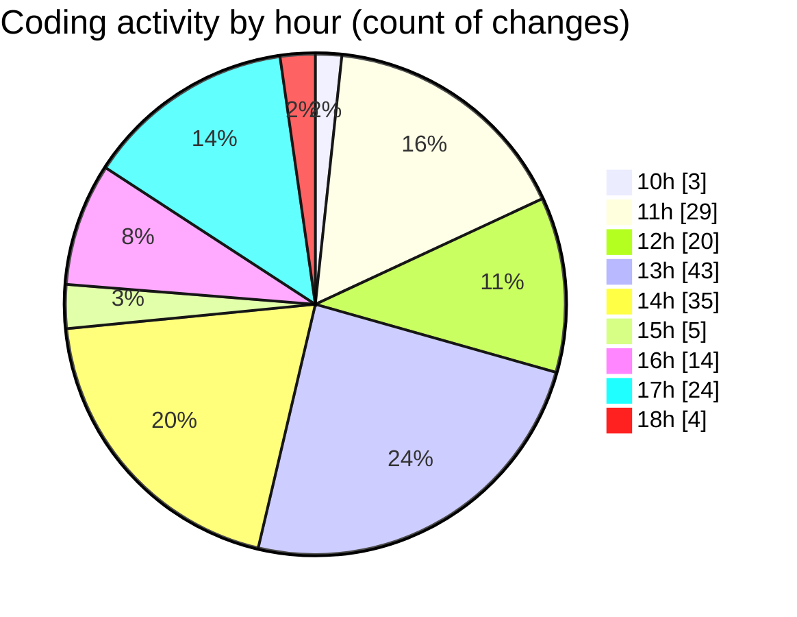

# ribbon - Activity Summary 

## Overall Statistics

| Stat                   | Value                                                             |
| ---------------------- | ----------------------------------------------------------------- |
| **Lines Added** (➕)   | 7556                                          |
| **Lines Removed** (➖) | 2594                                        |
| **Net Change** (↕)    | 4962                |
| **Active Time** (⌚)   | 248 minutes |

## Modified Files
- **settings.json** (+1776, -0)
- **DropArea.tsx** (+1252, -1023)
- **package.json** (+1, -0)
- **MaterialsFinder.tsx** (+203, -17)
- **Finder.tsx** (+191, -8)
- **MaterialSelector.tsx** (+94, -9)
- **package.json** (+272, -0)
- **globals.css** (+468, -0)
- **Import.tsx** (+2973, -1498)
- **react-dropzone.d.ts** (+103, -1)
- **MorphingScrim.tsx** (+223, -38)

## Visualizations

### By File Type (Lines Changed)

### By Hour (Estimated Activity Count)

> **Last Updated:** 14/08/2025, 18:07:03