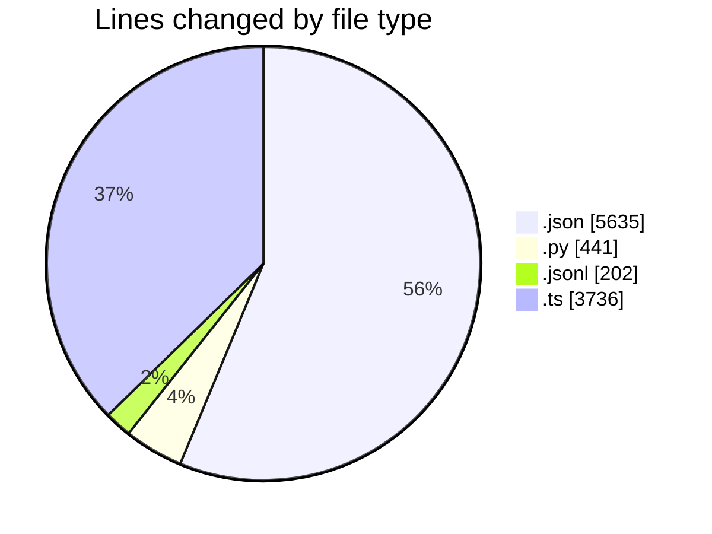
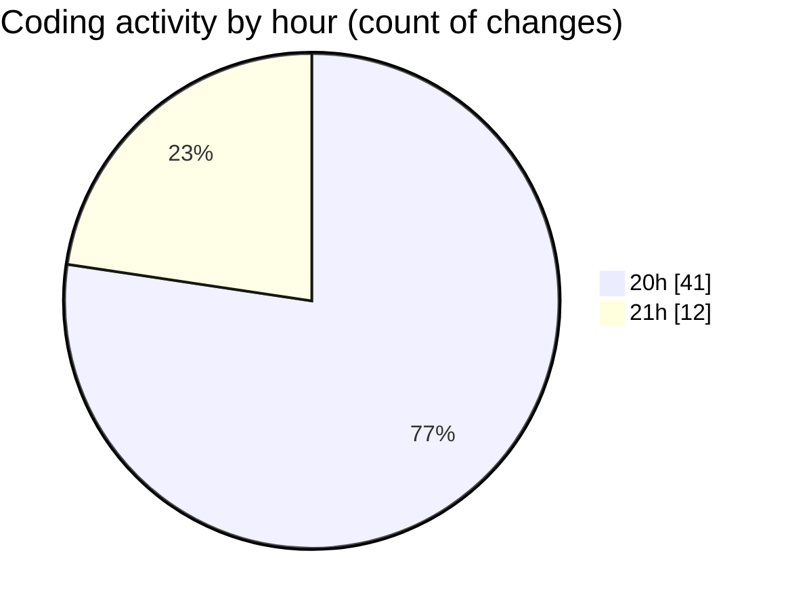

# .claude - Activity Summary 

## Overall Statistics

| Stat                   | Value                                                             |
| ---------------------- | ----------------------------------------------------------------- |
| **Lines Added** (➕)   | 9825                                          |
| **Lines Removed** (➖) | 189                                        |
| **Net Change** (↕)    | 9636                |
| **Active Time** (⌚)   | 53 minutes |

## Modified Files
- **settings.json** (+234, -0)
- **hook_logger.py** (+261, -180)
- **51469474-dce8-4070-9d49-66beb568f0ec.jsonl** (+202, -0)
- **claude-session-log-schema.ts** (+2292, -0)
- **settings.json** (+588, -2)
- **claude-hook-log-schema.ts** (+1437, -7)
- **.claude.json** (+4811, -0)

## Visualizations

### By File Type (Lines Changed)

### By Hour (Estimated Activity Count)

> **Last Updated:** 23/08/2025, 21:36:33