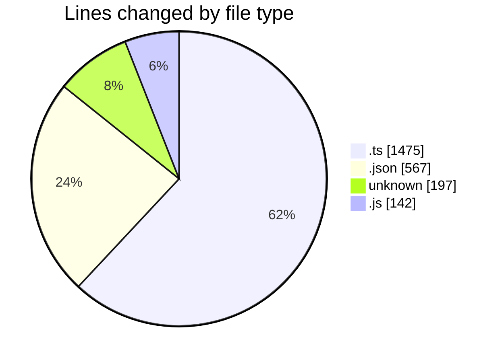
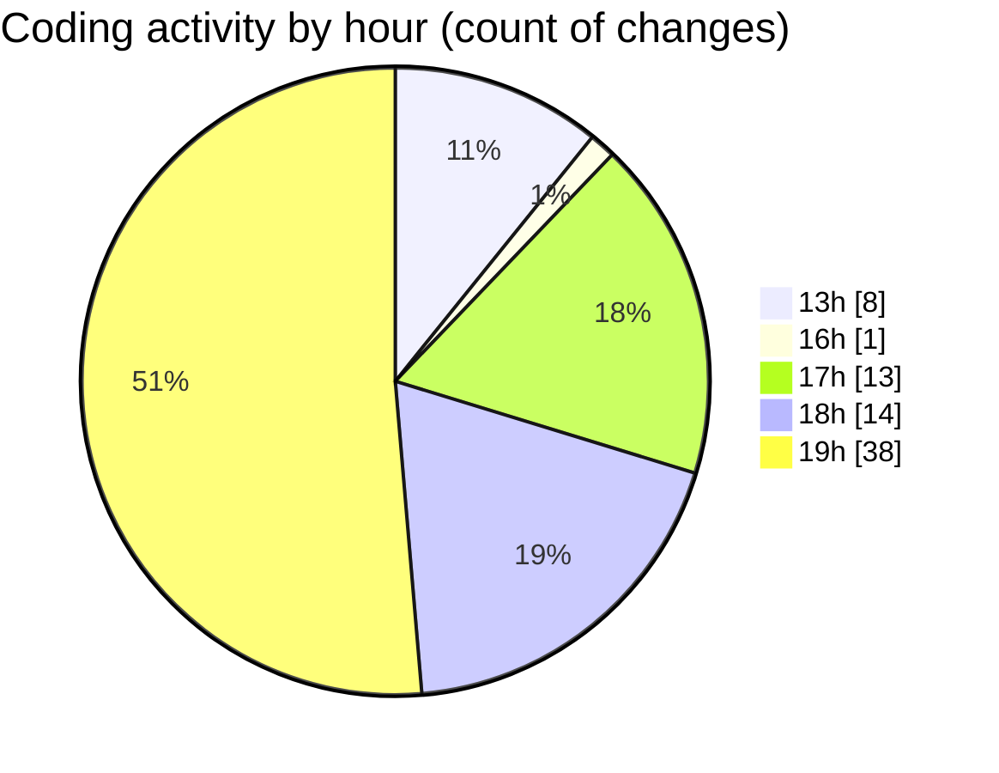

# chatgpt-extension - Activity Summary 

## Overall Statistics

| Stat                   | Value                                                             |
| ---------------------- | ----------------------------------------------------------------- |
| **Lines Added** (➕)   | 1698                                          |
| **Lines Removed** (➖) | 683                                        |
| **Net Change** (↕)    | 1015                |
| **Active Time** (⌚)   | 85 minutes |

## Modified Files
- **open-active-group-in-insiders.ts** (+281, -146)
- **tsconfig.json** (+135, -117)
- **package.json** (+223, -92)
- **.vscodeignore** (+105, -92)
- **extension.ts** (+777, -235)
- **build.ts** (+35, -1)
- **test-bun.js** (+32, -0)
- **test-extension.js** (+110, -0)

## Visualizations

### By File Type (Lines Changed)

### By Hour (Estimated Activity Count)

> **Last Updated:** 24/08/2025, 19:38:30