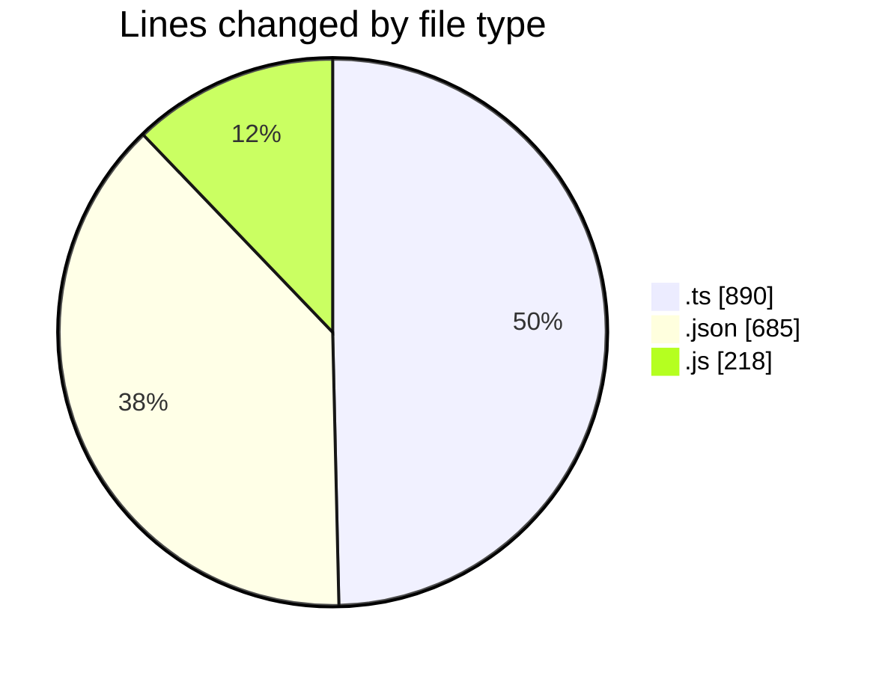
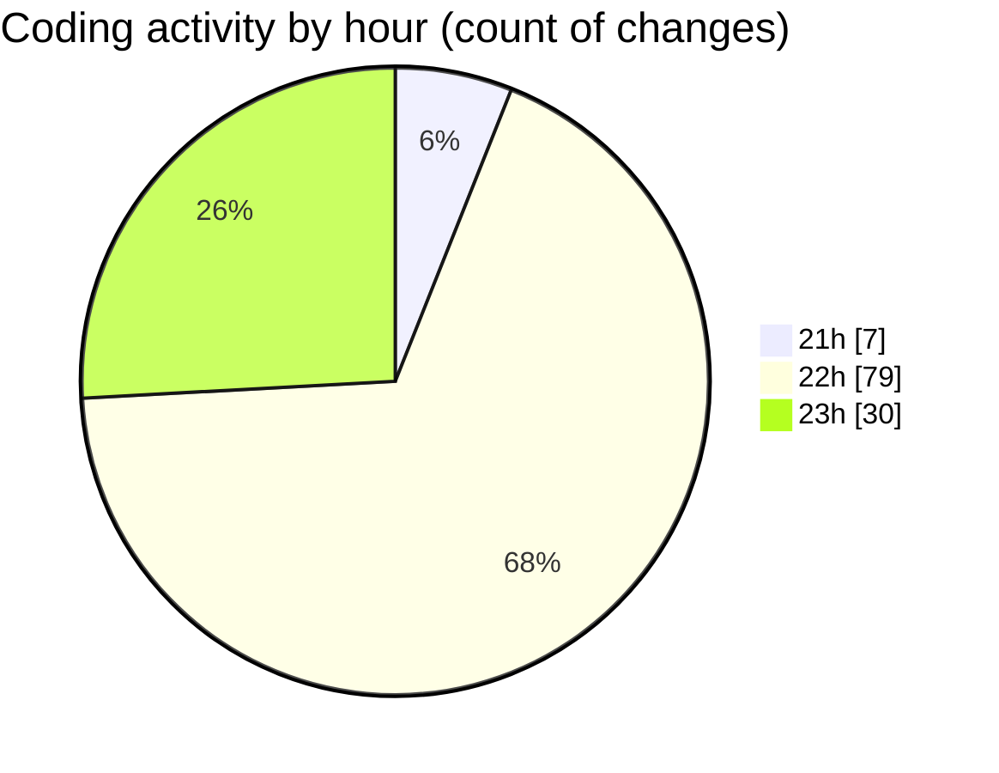

# mcp-web - Activity Summary 

## Overall Statistics

| Stat                   | Value                                                             |
| ---------------------- | ----------------------------------------------------------------- |
| **Lines Added** (➕)   | 1571                                          |
| **Lines Removed** (➖) | 222                                        |
| **Net Change** (↕)    | 1349                |
| **Active Time** (⌚)   | 147 minutes |

## Modified Files
- **index.ts** (+472, -152)
- **package.json** (+24, -2)
- **mcp.json** (+25, -12)
- **settings.json** (+588, -4)
- **test-mcp.js** (+117, -7)
- **generate-mcp-configs.js** (+89, -5)
- **test-mcp.test.ts** (+226, -40)
- **tsconfig.json** (+30, -0)

## Visualizations

### By File Type (Lines Changed)

### By Hour (Estimated Activity Count)

> **Last Updated:** 26/08/2025, 23:48:31