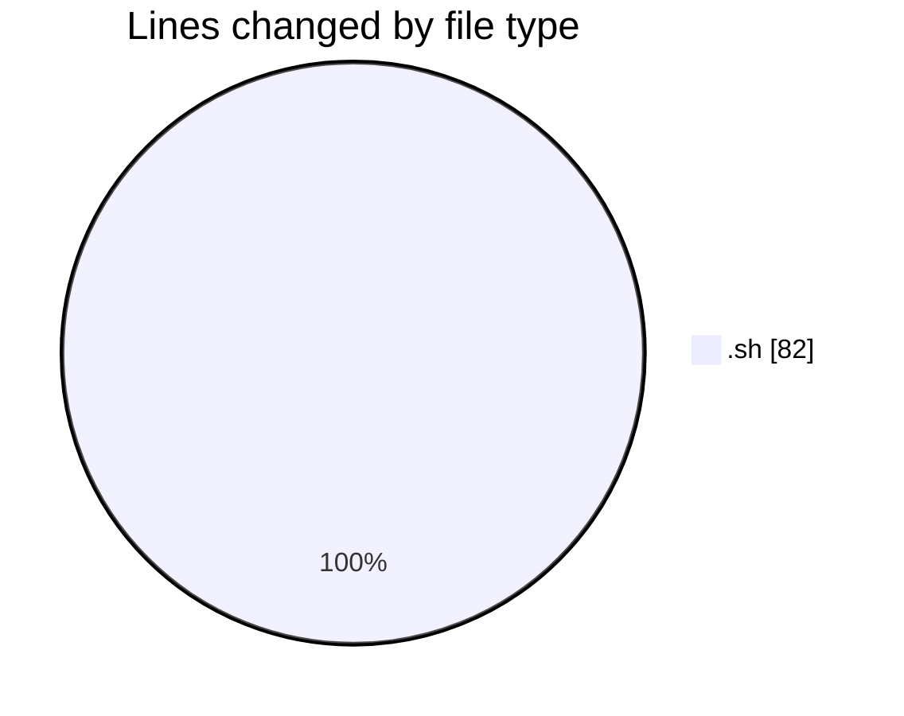
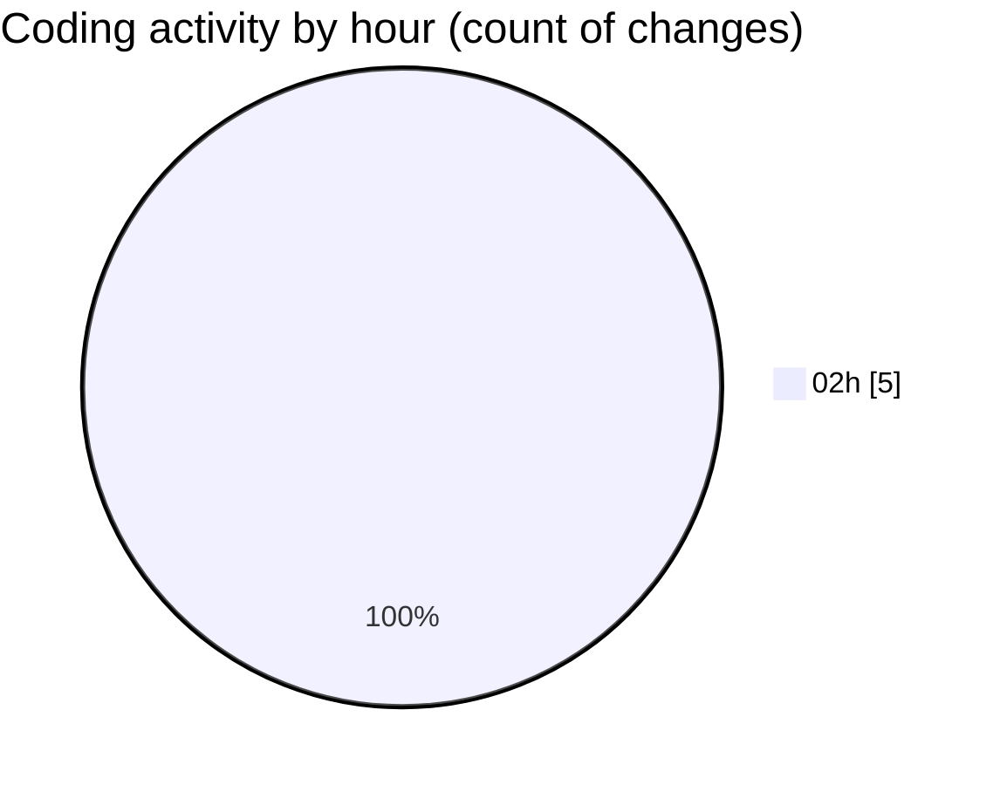

# .raycast - Activity Summary 

## Overall Statistics

| Stat                   | Value                                                             |
| ---------------------- | ----------------------------------------------------------------- |
| **Lines Added** (➕)   | 66                                          |
| **Lines Removed** (➖) | 16                                        |
| **Net Change** (↕)    | 50                |
| **Active Time** (⌚)   | 6 minutes |

## Modified Files
- **restart-raycast.sh** (+66, -16)

## Visualizations

### By File Type (Lines Changed)

### By Hour (Estimated Activity Count)

> **Last Updated:** 27/08/2025, 02:42:26